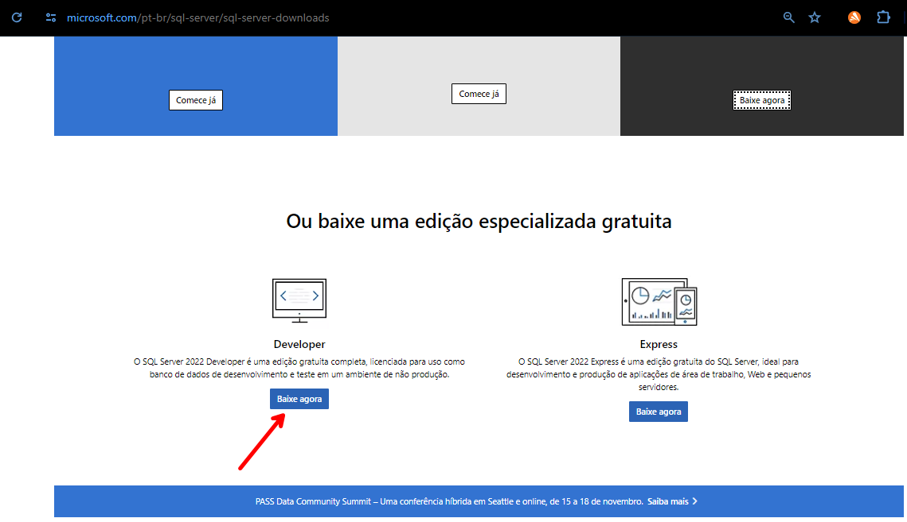
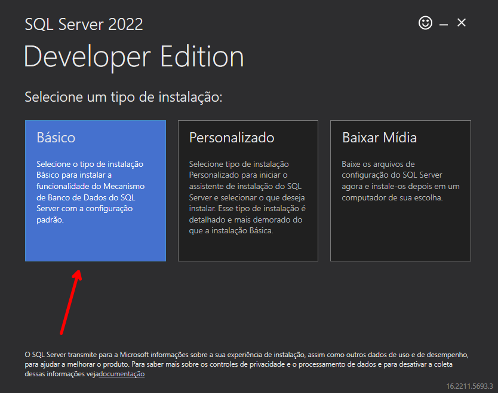
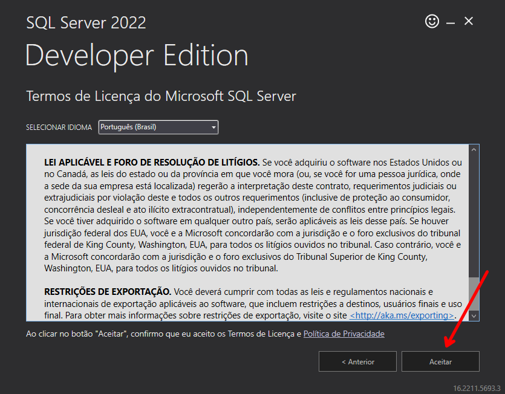
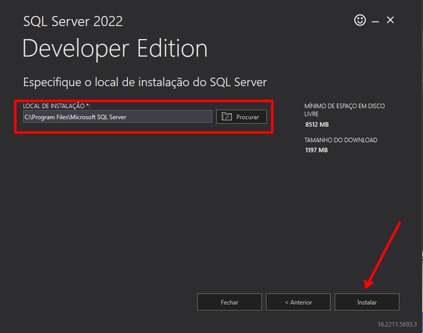
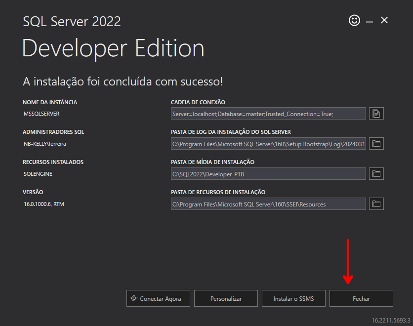
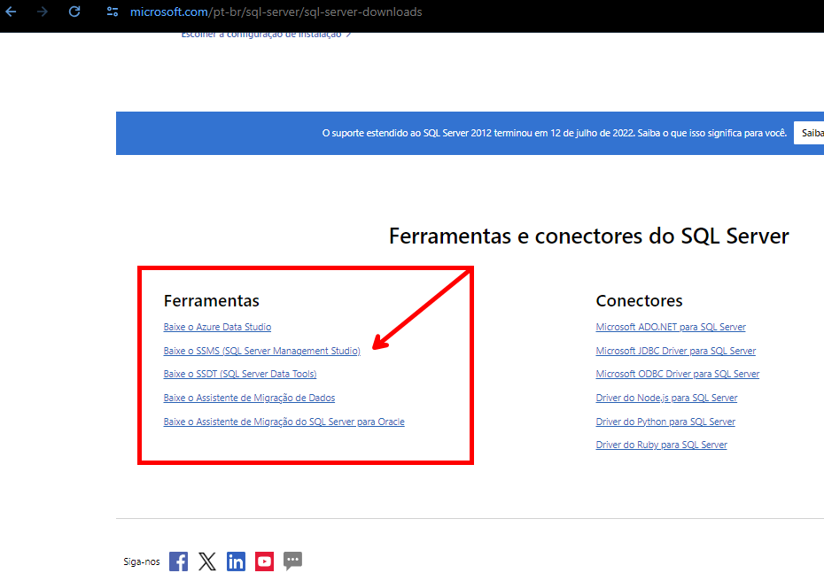
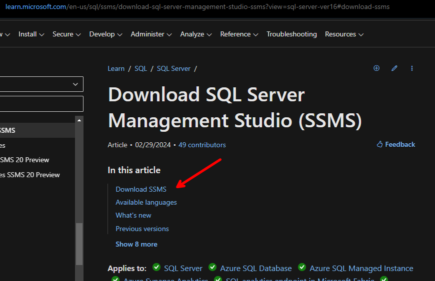
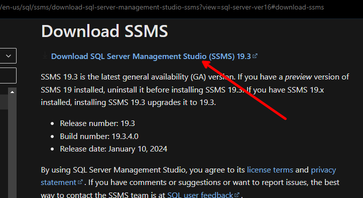
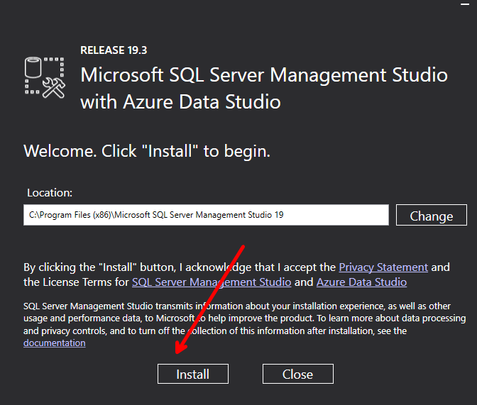
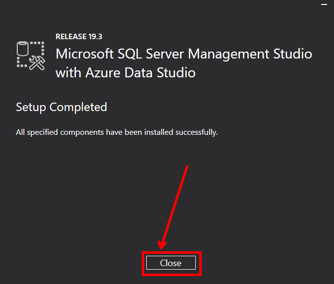

> Iremos trabalhar com o banco de dados da microsoft SQL Server

para isso se faz necessário a instalação em sem computador. Acesse o site oficial:

https://www.microsoft.com/pt-br/sql-server/sql-server-downloads

 Para nossa utilização iremos realizar o download da versão de desenvolvedor, pois não utilizaremos em ambiente comercial e não teremos licensa para comercialização, bem como este não será nosso intuito. Para trabalhos comercialmente consulte sobre as versões recomendadas, não sendo este o intuito do material.

 

Ao concluir o download realize a instalação.

Selecione o tipo de instalação como basico:

Faça a leitura e se de acordo Aceite os termos de licença do Microsoft SQL Server:

O local de instalção pode ser o padrão ou escolha outro de sua preferencia, e clique em instalar:

Aguarde o instalador baixar todos os pacotes de instalações necessários.
O tempo necessário depende da sua velocidade de conexão.

Ao concluir será exibido a tela com a mensagem que a instalação foi concluida com sucesso, e com os diretórios utilizados pelo SQL Server 

clique em fechar e a instalação estará pronta.

Nosso proximo passo será a instalação do SQL Server Management Studio, este é o SGDB que utilizaremos para trabalhar com o banco de dados SQL Server, onde faremos a criação, manipulaçao, alteração dos das estrututuras dos bancos e leitura, inserção, alteração e deleção dos dados.

No site onde baixamos o serviço, role a pagina abaixo para encontrar o SSMS

Será redirecionado para a pagina do learn da microsoft:
clique em : 

ira encaminhar para a sessão correspondente onde você ira clicar em :

aguarde o termino do download:

Ao termino execute a instalador: 

clique em install para iniciar a instalação:

Ao terminar clique em close:

