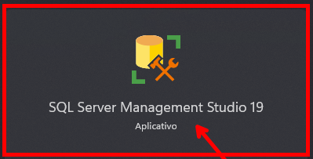
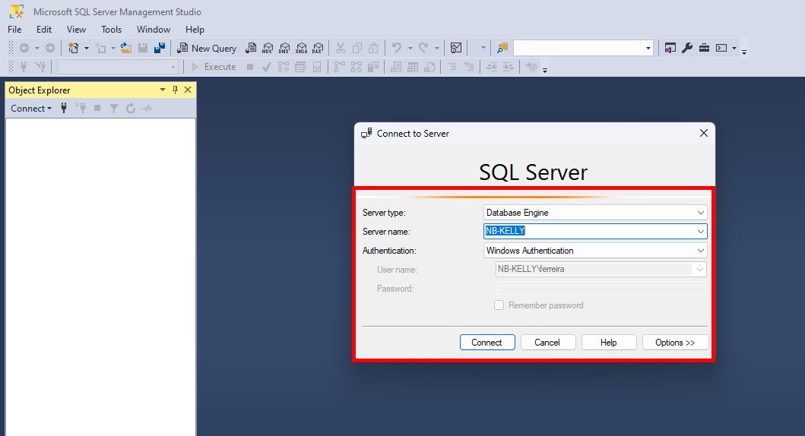
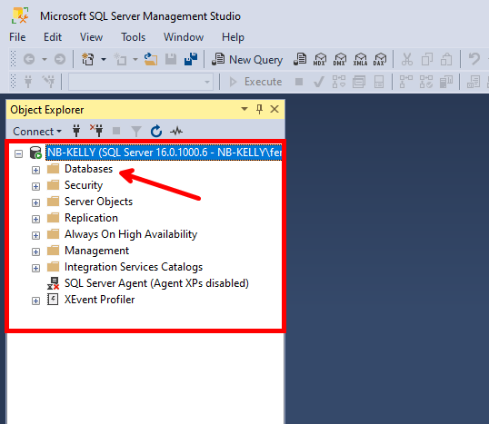
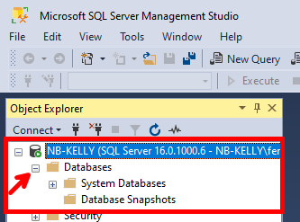

No menu iniciar procure pelo aplicativo 

Sera iniciado solicitando que informe os dados da conexão, por padrão será carregado os dados necessários para a conexão local:

as bases de dados se encontraraão dentro da pasta databases 

ao clicar na pasta se expandira e haverá os databases padrões, neste momento evite alterá-los.

este será o local onde criaremos nossos bancos de dados para nossas aplicações.

Nos próximos conteúdos iremos criar nosso primeiro banco de dados!!!!